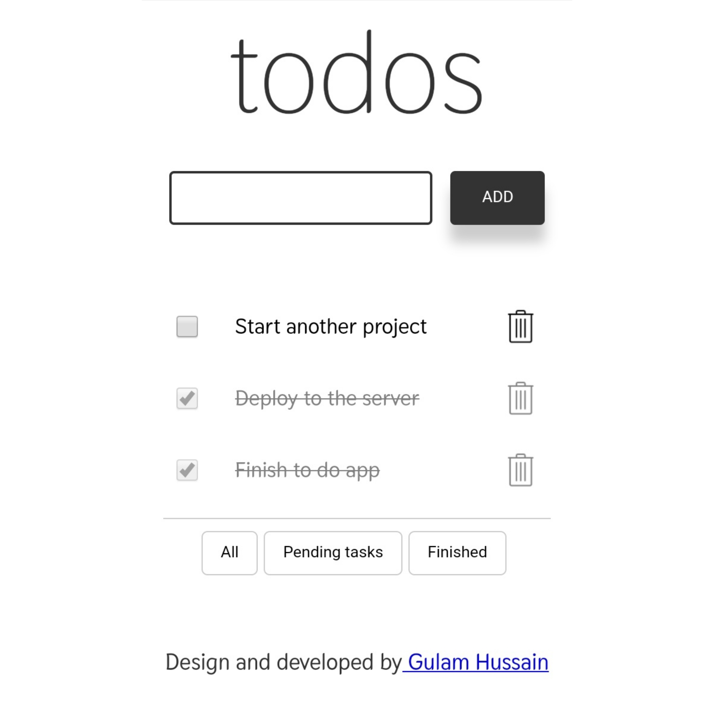

This is a ToDo app developed using ***React JS and it use Browser's local storage*** to store the current state of the app.

### Features of this app

* Add and Remove Todo item.
* Filter pending and completed tasks.
* Persist App state even if user closes the tab or browser window.
* Mobile responsive, clean and minimal design

 [check out the live demo here](https://todoappbyhussain.netlify.com/)
 
 ### Screen shot

 

## Available Scripts

In the project directory, you can run:

### `npm install`
### `npm start`

